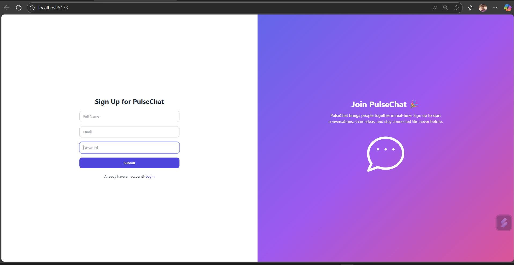
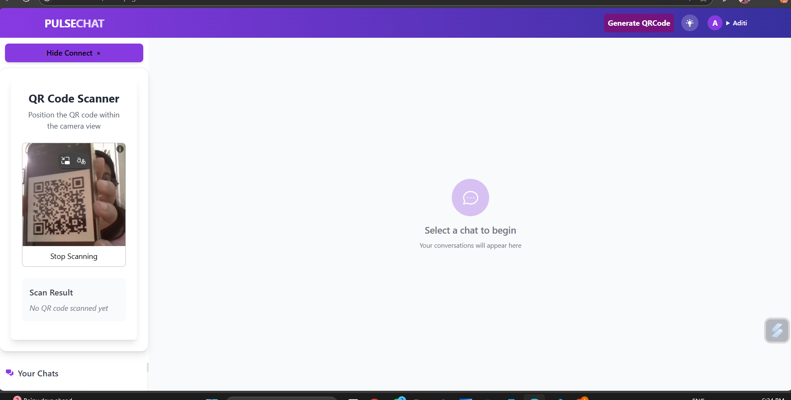
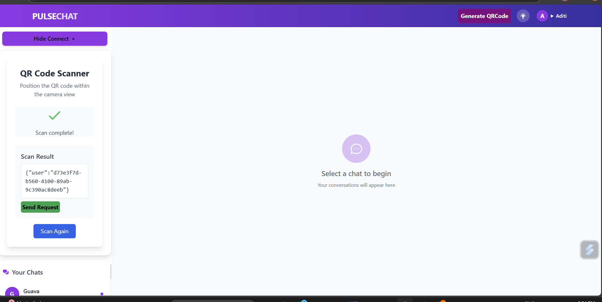
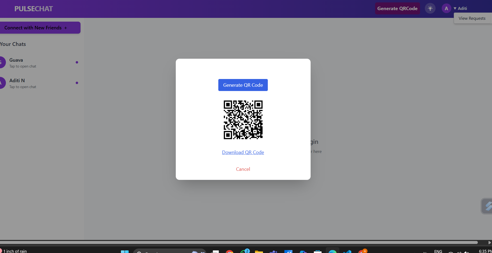
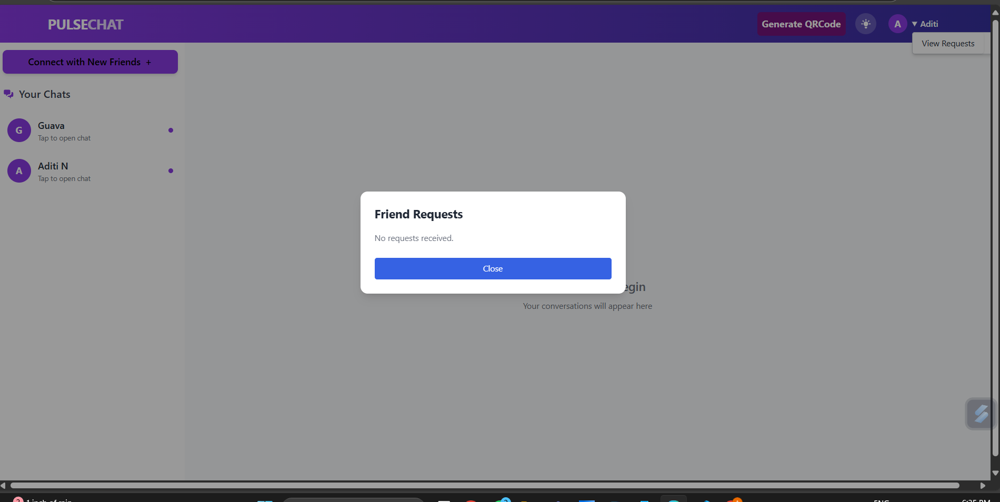
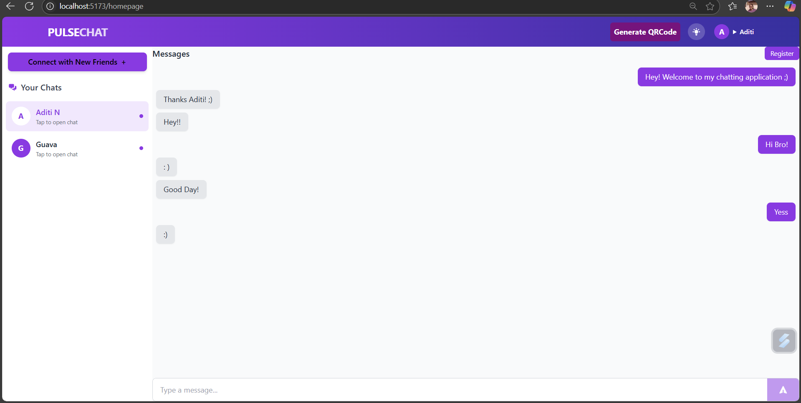

# 💬 ChatStream — Secure & Verified Real-Time Chat Application

ChatStream is a privacy-first real-time chat application that blends simplicity, security, and innovation. Designed with modern tools and user verification at its core, ChatStream lets users connect through QR code sharing and invite only to chat securely in real-time using **IO sockets**.

---

## 🚀 Features

### 🛡️ Verified User System
- New users must **register** and confirm their email via a **verification link**.
- Only verified users can access the platform and initiate interactions.

### 🔗 Add Friends via QR Code
- Each user can **generate a unique QR code** to share with friends.
- Others can **scan this QR code** using a live scanner to fetch your user ID.
- This ID is **not public** — no one can message you unless approved by you in invite and request manager panel UI.

### ✅ Friend Request System
- Incoming friend requests can be **accepted or rejected** manually.
- Only **approved friends** appear in your chat interface.

### 💬 Real-time & Secure Chat
- Chat with friends using **Socket.IO for real-time communication**.
- Non-socket fallback supported for broader compatibility.

---

## 🖼️ App Flow (Screenshots)

1. **Registration & Email Verification**
   

2. **Live QR Code Scanning**
   

3. **Scanner Result to send Request on Valid user auth**
   
   
5. **QR Code Generation**
   

4. **Friend Requests Interface**
   

5. **Live Chat UI**
   

---

## ⚙️ Tech Stack

| Layer          | Technology          |
|----------------|---------------------|
| 💻 Frontend     | React + Vite        |
| 🎨 Styling      | Tailwind CSS        |
| 🌐 Backend      | Node.js + Express   |
| 🔌 Real-Time    | Socket.IO           |
| 🔐 Authentication | Custom with Email Verification |
| 📦 API Routes   | RESTful API         |

---

## 🗃️ Database Schema

The app uses a relational database schema to support core chat functionalities, including user management, real-time messaging, friendships, and presence tracking.

### **Tables Overview**

#### `users`
Stores registered user information.
- `id` (UUID): Primary key  
- `name` (Text): User's name  
- `email` (Text): User's email  
- `created_at` (Timestamp): Registration date  
- `socket_id` (Text): Active socket session ID  

#### `messages`
Logs all chat messages exchanged between users.
- `id` (UUID): Primary key  
- `chat_id` (UUID): FK to `chats`  
- `sender_id` / `receiver_id` (UUID): FK to `users`  
- `content` (Text): Message body  
- `sent_at` (Timestamp): Sent time  

#### `chats`
Represents unique 1-on-1 conversations.
- `id` (UUID): Primary key  
- `user1` / `user2` (UUID): FK to `users`  
- `last_message_at` (Timestamp): Last activity in chat  

#### `friendships`
Handles friend requests and connections.
- `id` (UUID): Primary key  
- `sender_id` / `receiver_id` (UUID): FK to `users`  
- `request_status` (Text): Status of request (e.g. pending, accepted)  
- `created_at` (Timestamp): Request timestamp  

#### `online_users`
Tracks active users in real-time.
- `user_id` (UUID): FK to `users`  
- `socket_id` (Text): Socket session ID  
- `last_active` (Timestamp): Last seen timestamp  

## 🌐 API Routes

The backend exposes the following API endpoints located in the `/routes` directory. These routes handle user registration, friend requests, chats, and more.

### **Available Endpoints**

| Endpoint            | Description |
|---------------------|-------------|
| `/signup`           | Handles new user registration and stores user info in the database. |
| `/identity`         | Returns the authenticated user's details based on their token. |
| `/sendReq`          | Sends a friend request from one user to another. |
| `/acceptrequest`    | Accepts an incoming friend request and establishes a connection. |
| `/chats`            | Retrieves the chat list for a given user, including recent messages. |
| `/chatId`           | Gets or creates a unique chat ID between two users on invite accept. |
| `/chatprofile`      | Fetches profile details of a user in a chat. |
| `/qrcode`           | Generates or decodes a QR code for quick access or identity sharing. |
| `/requestAccess`    | Handles sent requests|
| `/text`             | Handles plain text message input or related utilities (context-dependent). |

